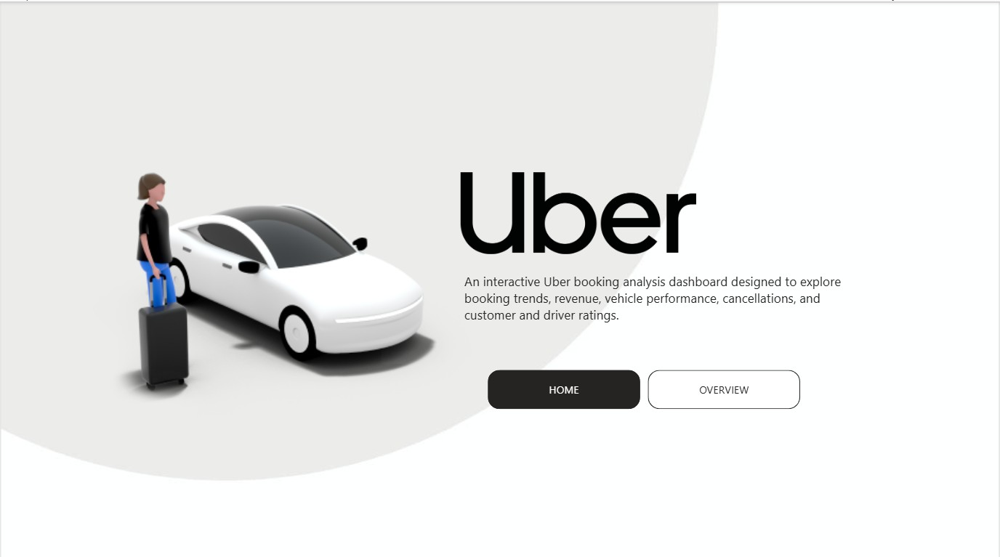
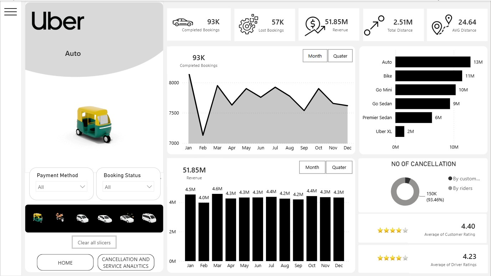
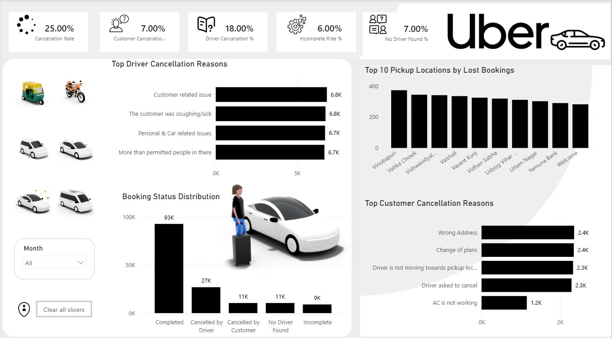

# 🚕 Uber Power BI Analysis

An interactive Power BI dashboard created to analyze Uber booking performance, revenue, cancellations, vehicle types, distance, and customer/driver ratings.

## 📌 Project Overview

* Analyzed Uber booking data using **Power BI**.
* Transformed and prepared the dataset using **Power Query**.
* Created interactive dashboards using **DAX measures and Power BI visuals**.
* Analyzed completed and lost bookings to understand booking performance.
* Studied revenue trends across different vehicle types and months.
* Analyzed customer and driver cancellation patterns.
* Evaluated customer and driver ratings.
* Used interactive slicers to allow users to explore the data dynamically.

## 🛠️ Tools & Technologies

* **Power BI**
* **Power Query**
* **DAX**
* **Microsoft Excel**

## 📊 Key KPIs

* Completed Bookings
* Lost Bookings
* Total Revenue
* Total Distance
* Average Distance
* Average Customer Rating
* Average Driver Rating

## 📈 Dashboard Features

* Booking status analysis
* Revenue analysis by vehicle type
* Monthly revenue trends
* Completed booking trends
* Customer cancellation analysis
* Driver cancellation analysis
* Customer and driver rating analysis
* Interactive filtering using:

  * Payment Method
  * Booking Status
  * Vehicle Type

## 🔍 Analysis Performed

* Compared completed bookings with lost bookings.
* Identified revenue contribution from different vehicle types.
* Analyzed booking trends over time.
* Examined cancellation behavior from customers and drivers.
* Studied distance-related booking patterns.
* Compared customer and driver ratings.
* Created KPI cards to provide a quick overview of business performance.

## 🖼️ Dashboard Preview

### Page 1

### Page 2

### Page 3

## 📁 Project Files

* `Uber-Dashboard.pbix` — Power BI dashboard file
* `Uber-Dataset.xlsx` — Dataset used for analysis
* `Uber-Dashboard-Page1.png` — Dashboard screenshot
* `Uber-Dashboard-Page2.png` — Dashboard screenshot
* `Uber-Dashboard-Page3.png` — Dashboard screenshot

## 🎯 Skills Demonstrated

* Data Cleaning
* Data Transformation
* Data Modeling
* DAX
* Time Intelligence
* KPI Development
* Data Visualization
* Business Analysis
* Dashboard Design
* Insight Generation

